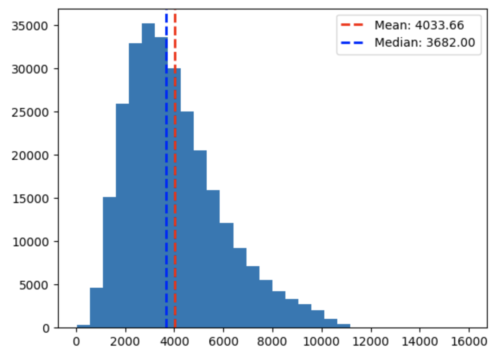
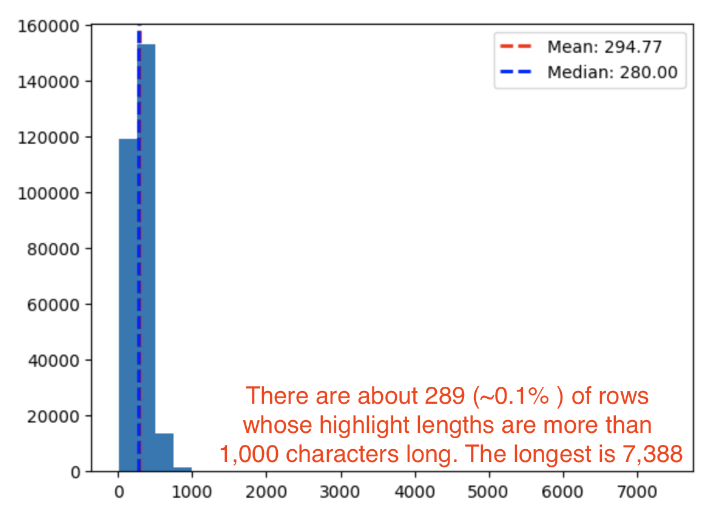

# cnn_dailymail

This repo contains exploratory code for doing text summarization using the CNN Daily Mail dataset.

## Dataset

We use the data source from huggingface: https://huggingface.co/datasets/cnn_dailymail.
There are three different "configurations": 1.0.0, 2.0.0, 3.0.0, and we will focus on the latest configuration 3.0.0.

The dataset contains 3 splits:
- train: 287,113 rows
- validation: 13,368 rows
- test: 11,490 rows

The dataset has 3 columns: "article", "highlights" and "id".
- The average length of "article" is about 4000 characters, and its distribution looks like below.
  
- The average length of "highlights" is around 300, but there are a small number of outliers.
  

Note that the distribution above is computed from the training set,
but we verified that the validation and test sets have similar characteristics.

## Evaluation
We used the [rouge-score](https://pypi.org/project/rouge-score/) package implemented by Google research as the main tool for evaluation.

| Date          | Method                                   | ROUGE-1 Score | ROUGE-L Score |
|---------------|------------------------------------------|---------------|---------------|
|  May 13, 2023 | Take first 300 characters in the article | 0.388         | 0.239         |
|               |                                          |               |               |
|               |                                          |               |               |

### Baselines

* May 13, 2023 The first baseline we used is just taking the first 300 characters (average length of the training highlights) and use that as the summary.
  We got a ROUGE-1 score of 0.388 and ROUGE-L score of 0.239.

## Misc
This Google doc contains more details: https://docs.google.com/document/d/1Wo8XGGTlYwxIs5_lbtRolKsfBMQzB9TP8BnUxxHTKX8/.
