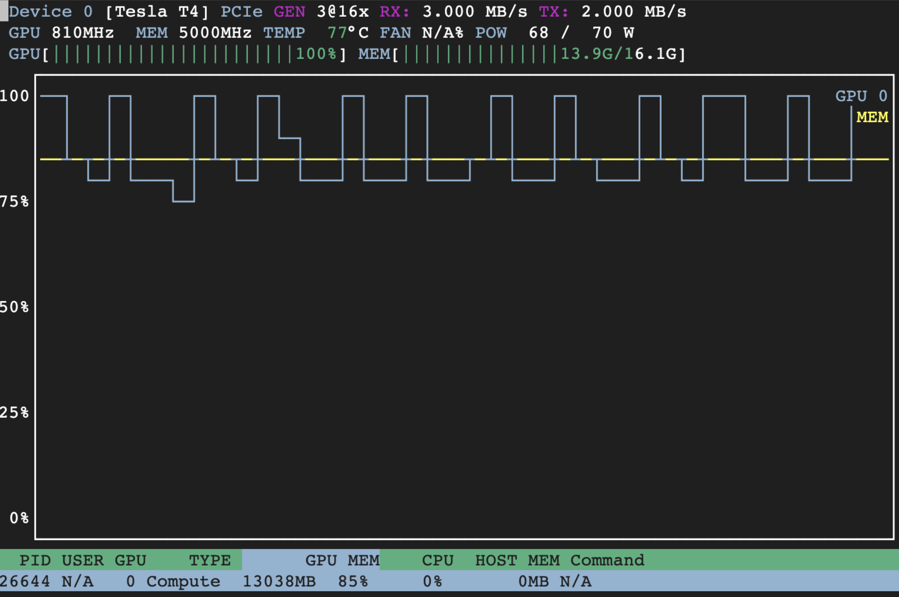

# cnn_dailymail

This repo contains exploratory code for doing text summarization using the CNN Daily Mail dataset.

## Dataset

We use the data source from huggingface: https://huggingface.co/datasets/cnn_dailymail.
There are three different "configurations": 1.0.0, 2.0.0, 3.0.0, and we will focus on the latest configuration 3.0.0.

The dataset contains 3 splits:
- train: 287,113 rows
- validation: 13,368 rows
- test: 11,490 rows

The dataset has 3 columns: "article", "highlights" and "id".
- The average length of "article" is about 4000 characters, and its distribution looks like below.
  
- The average length of "highlights" is around 300, but there are a small number of outliers.
  

Note that the distribution above is computed from the training set,
but we verified that the validation and test sets have similar characteristics.

## Evaluation
We used the [rouge-score](https://pypi.org/project/rouge-score/) package implemented by Google research as the main tool for evaluation.

### Entire Validation Dataset

| Date          | Method                                                              | ROUGE-1 Score | ROUGE-2 Score | ROUGE-L Score |
|---------------|---------------------------------------------------------------------|---------------|---------------|---------------|
|  May 19, 2023 | Use Huggingface pre-trained pipeline `facebook/bart-large-cnn`      | 0.435         | 0.212         | 0.306         |
|  May 20, 2023 | Use Huggingface pre-trained pipeline `google/pegasus-cnn_dailymail` | 0.427         | 0.210         | 0.305         |
|  May 13, 2023 | Take first 300 characters in the article                            | 0.388         | 0.160         | 0.239         |
|  May 13, 2023 | Use the entire article as summary                                   | 0.157         | 0.090         | 0.114         |

### Random 100 Samples

| Date          |                                                     | ROUGE-1 Score | ROUGE-2 Score | ROUGE-L Score |
|---------------|-----------------------------------------------------|---------------|---------------|---------------|
|  May 25, 2023 | Pretrained "facebook/bart-large-cnn"                | 0.444         | 0.228         | 0.316         |
|  Jun 4, 2023  | LangChain OpenAI with prompt limiting to 75 words   | 0.384         | 0.150         | 0.245         |
|  Jun 1, 2023  | LangChain summarize calling OpenAI (default prompt) | 0.377         | 0.146         | 0.236         |
|  May 13, 2023 | Take first 300 characters in the article            | 0.367         | 0.157         | 0.230         |
|  May 25, 2023 | Pretrained "google/flan-t5-large"                   | 0.163         | 0.066         | 0.132         |

## Journal

### Jun 4, 2023

Used langchain on OpenAI with preliminary prompt engineering,
and get results slightly better than first-300-character baseline.
* It took ~10 seconds per row for sending the request to OpenAI, or ~20 minutes for 100 rows. It costs about $2 on OpenAI to run through 100 rows.
* The [langchain tracing](https://python.langchain.com/en/latest/additional_resources/tracing.html) is a very useful tool for prompt engineering.
* Prompt engineer to control the output length (e.g. "using less than 75 words") improves ROUGE score by about 0.5%.

### May 19, 2023

Moved to Google Colab and run inference on huggingface pre-trained pipeline with the `facebook/bart-large-cnn` model.
The score we get is better than first 300 character baseline we get before, but
lower than those on the [leaderboard](https://paperswithcode.com/sota/document-summarization-on-cnn-daily-mail).

It takes more than 2 hours to run inference on 13K validation rows, about 1.6 row per seconds.
The execution is on a T4 GPU with batching, and the GPU utilization is around 80%.

Similarly for the `google/pegasus-cnn_dailymail` model, which requires `sentencepiece` to be installed.
With near 100% GPU utilization, it takes ~1.4 seconds per row, and 5 hours to process the entire validation set.

### May 13, 2023

Implemented a few baseline methods, such as using the article itself or the first 300 characters (average length of the training highlights).

## Misc
This Google doc contains more details: https://docs.google.com/document/d/1Wo8XGGTlYwxIs5_lbtRolKsfBMQzB9TP8BnUxxHTKX8/.
